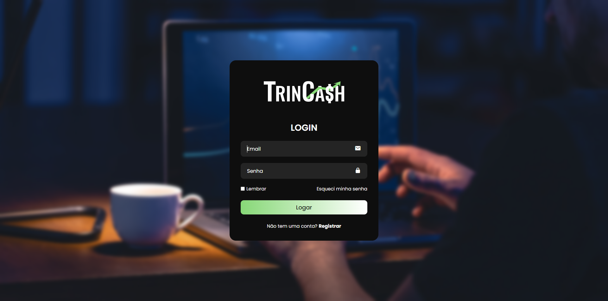

# TrinCash

Aplicação web para controle financeiro pessoal. Projeto em desenvolvimento.

## Status
Em construção. Estrutura e funcionalidades podem mudar.

## Tecnologias
- Node.js  
- Express  
- MongoDB  
- Prisma  
- HTML  
- CSS  
- JavaScript

## Funcionalidades Atuais
- Autenticação básica  
- Sessões no servidor  
- Proteção de rotas  
- Estrutura inicial de interface

## Funcionalidades Futuras
- Painel financeiro completo  
- Cadastro e gerenciamento de transações  
- Relatórios e análises  
- Melhorias visuais e de navegação  
- Camada de autorização ampliada

## Preview

